# Glaucus

## Glaucus是什么
**Glaucus**是一个 *基于数据流* 的机器学习套件，结合了**自动化机器学习管道**，对繁杂机器学习**算法的简化流程**以及优秀**分布式处理引擎**的应用，面向跨领域的**非数据科学专业人士**，使得在最简化机器学习前沿成果的同时却能享受强大的功能。  

我们的平台集成了众多优秀的数据引擎包括**Spark**，**Tensorflow**，**Scikit-learn**，并且在这之上建立了设计了一套简单易用的流程，用户只需上传数据，进行简单配置，选择算法，自动或手动调参就可以进行训练，对训练后的模型，平台也提供丰富的评估指标，让非专业人士能够最大程度上发挥机器学习的作用，整个平台功能结构如下图所示，其主要功能点在于：  

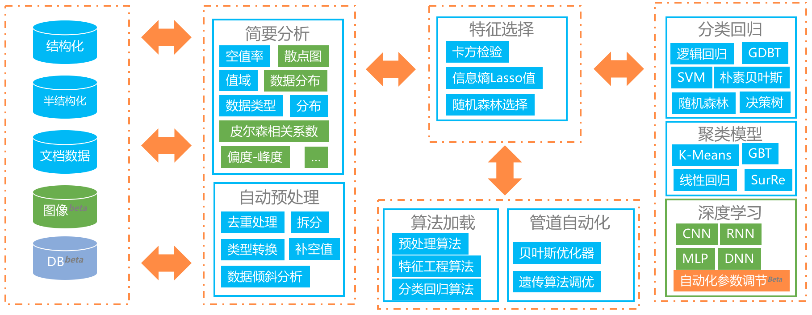

- 接收**多源数据集**，包括结构化，文档数据和图像数据；
- 提供丰富的**数理统计函数**，图形化界面能让用户轻松掌握数据情况；
- 在自动模式下，从预处理到特征工程再到机器学习算法实现**全管道自动化**；
- 在手动模式下，大幅度**简化机器学习管道流程**，提供包括自动化数据清洗，半自动化特征选择以及深度学习套件；

## Glaucus的技术架构
系统采用了MVC框架，大致分为React前端，Spring Boot+Flask业务层以及Spark+Scikitlearn+Keras数据引擎层，具体为下图架构图所示，系统共分为4个部分：
  

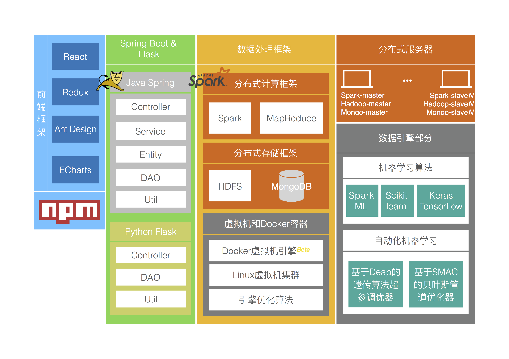

  
- 前端使用了**React+Redux**的框架，设计部分使用了Ant Design，图表部分使用了Ant Design。
- 业务层主要使用了**Spring Boot**(Java)和**Flask**(Python)做为RESTful接口的提供。
- 数据处理框架部分主要以分布式框架**Spark**为基础，向上扩展了以HDFS和MongoDB做为数据持久层的存储模式，向下扩展了以Docker和Linux虚拟机为基础的运行环境，并且进行了Shuffle算子等的优化，分布式服务器部分主要是展示了Spark，Hadoop和MongoDB的部署情况。
- 数据引擎部分主要使用了分布式机器学习库**Spark ML和Tensorflow为基础的Keras框架**，自动化机器学习主要使用了基于SMAC**贝叶斯优化器管道调优**auto-sklearn以及基于Deap**遗传算法超参调优**TPOT。

## 搭建Glaucus
Pull我们的工程，进入`/glaucus`，分别有`/java`, `/python`, `/web`三个文件夹，依照[QuckStart.md](https://github.com/ccnt-glaucus/glaucus/blob/master/QuickStart.md)的步骤进行部署，就可以成功运行我们的项目。

## 使用Glaucus
下面以两个例子演示手动模式和自动模式下，Glaucus平台的使用情况。
### 1. 手动模式

- 首先找到`/data/test.csv`文件（为**真实用户数据**一部分），进入我们平台后，点击上传文件，数据会自动上传到云端服务器；

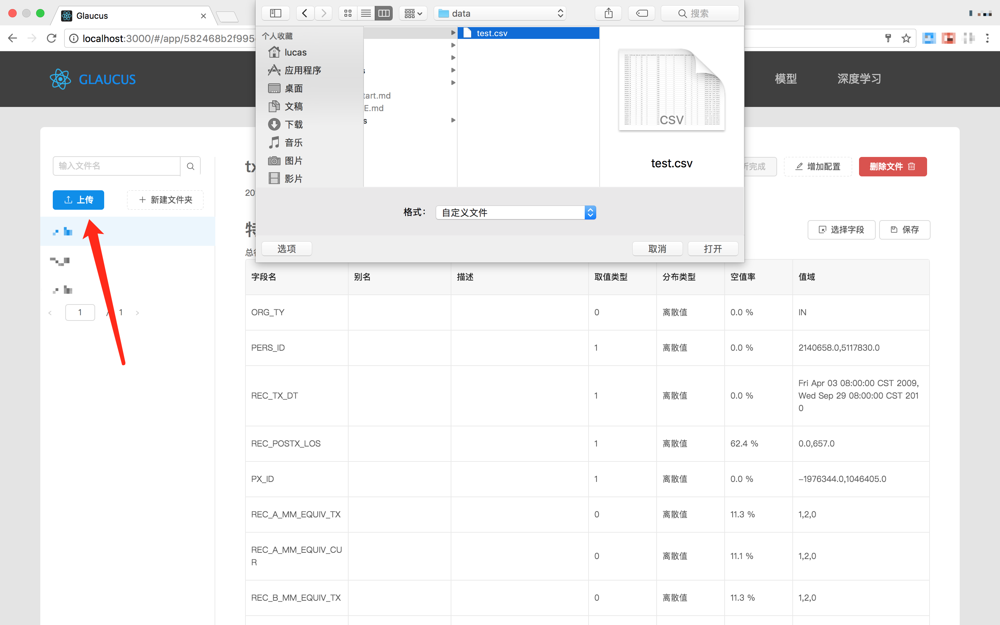

- 上传文件后，会看到系统自动分析出的字段，此时用户可以点击**开始分析**进行文件的简要分析，本例不做过多阐述，此时点击**增加配置**按钮；

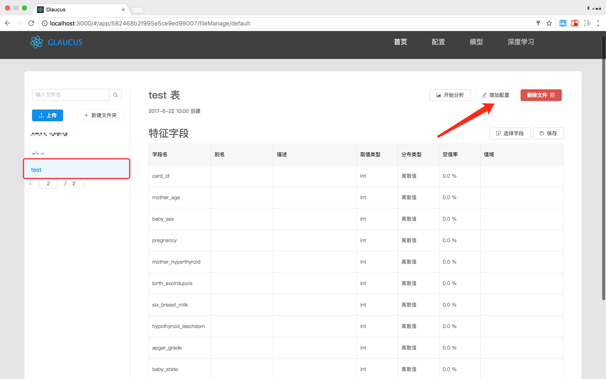

- 进入配置界面后，第一步先填写和选择红框部分完成配置，包括*配置名称*，*模型的主要类别*以及*选择训练特征*（此时，用户可以**自动选取特征**，此处也不过多阐述）；

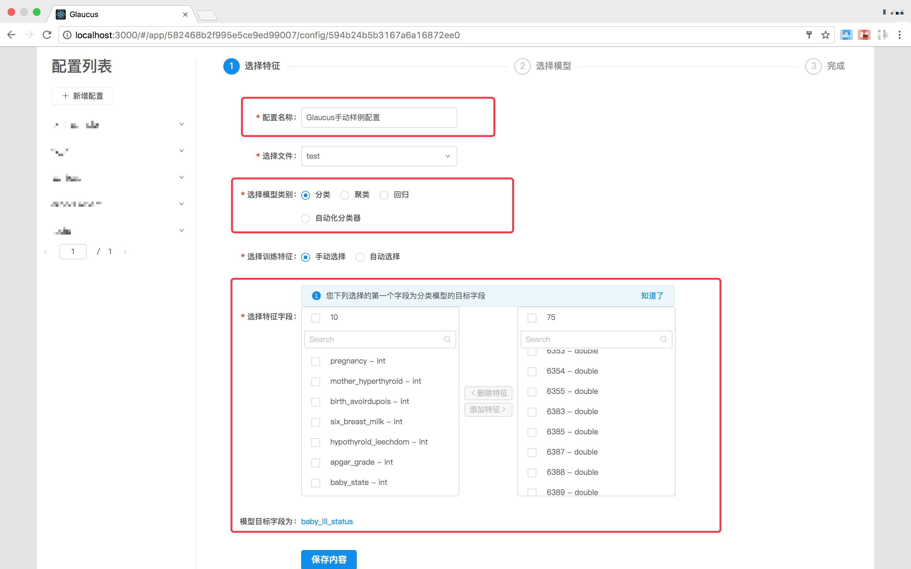

- 第二步，进行具体的模型和参数调整，如下图红框所示；

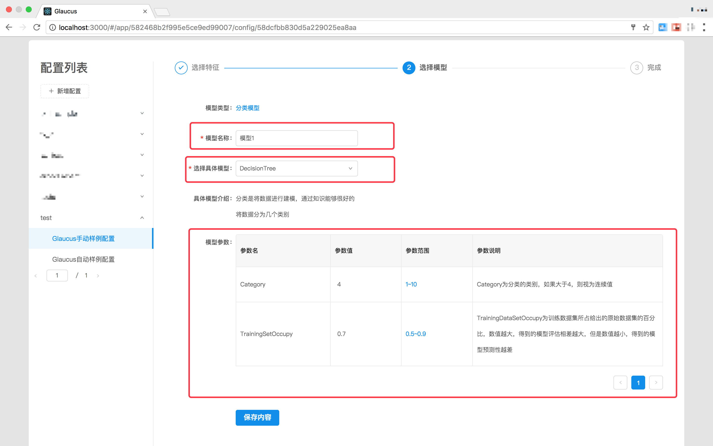

- 最后，确认所有信息后，开始训练

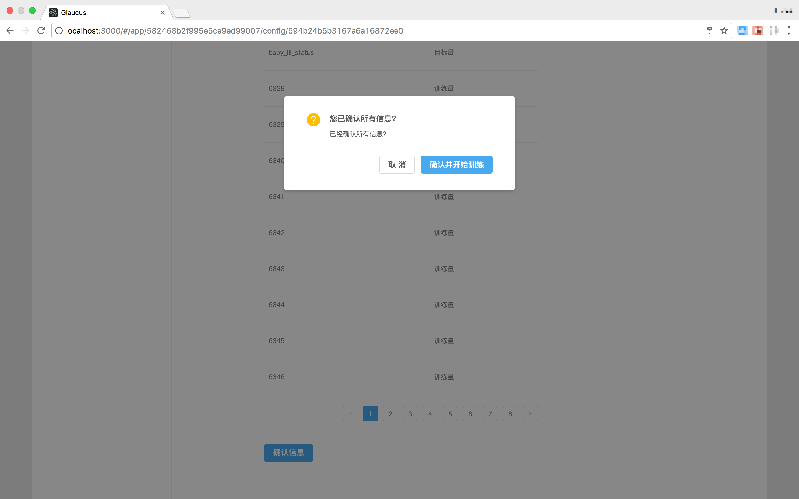

- 训练完成后，可以查看训练的模型结果，系统也会自动保存用户训练的结果，此时可以**使用模型**(此处不再赘述);

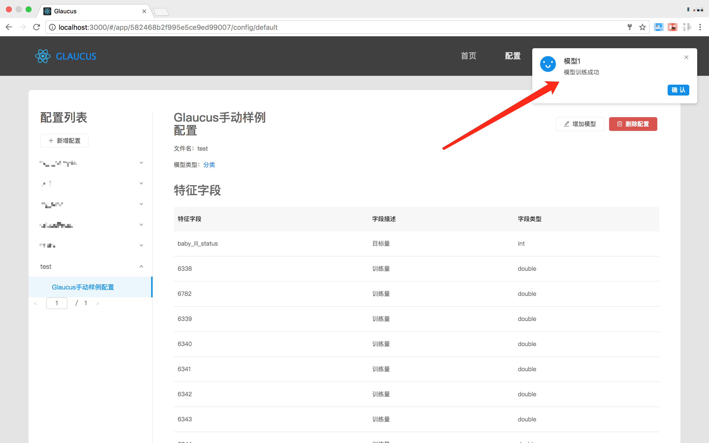

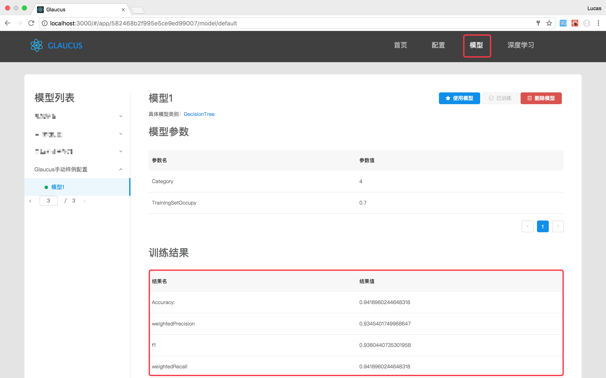

### 2. 自动模式

- 接*上例*中的文件`/data/test.csv`，再次点击**增加配置**按钮

- 进入配置界面后，在`选择模型类别`处选择**自动化分类器**，在完成红框处填写之后，可以完成自动化模型的添加；

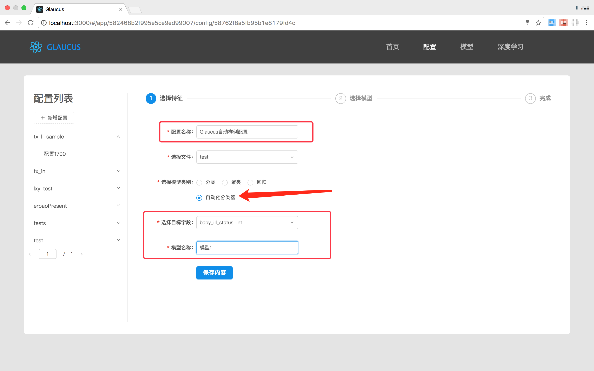

- 经过训练后可以查看自动化训练模型的结果；

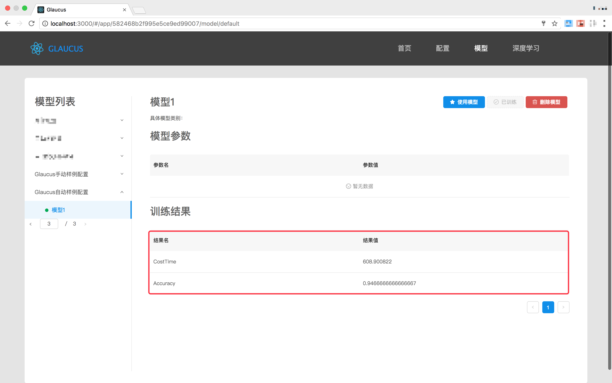

## Glaucus成员
下列成员对**Glaucus项目**作出贡献：

- [尹建伟](http://mypage.zju.edu.cn/0001038)， 教授，浙江大学计算机科学与技术学院CCNT实验室
- 范子琨，浙江大学计算机科学与技术学院CCNT实验室
- 廖翔勇，浙江大学计算机科学与技术学院CCNT实验室
- 唐文博，浙江大学计算机科学与技术学院CCNT实验室

