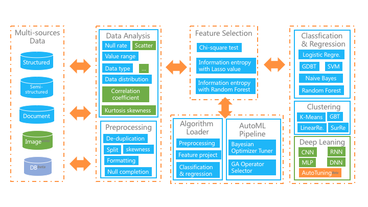
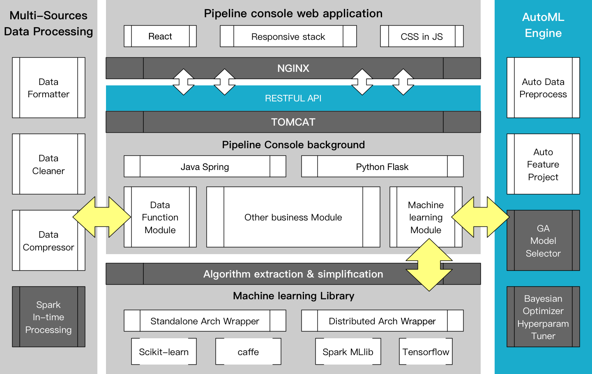
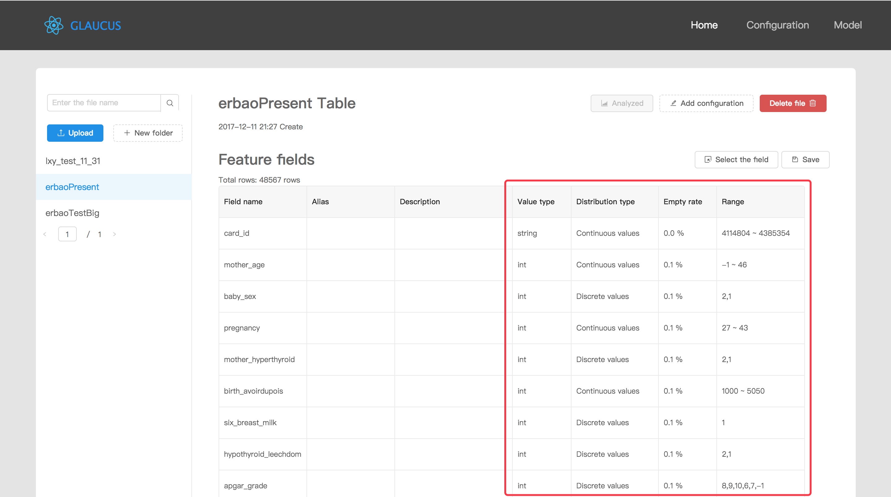
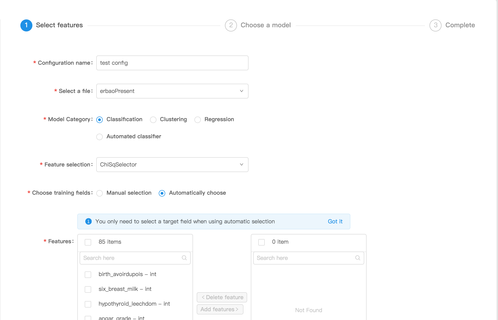
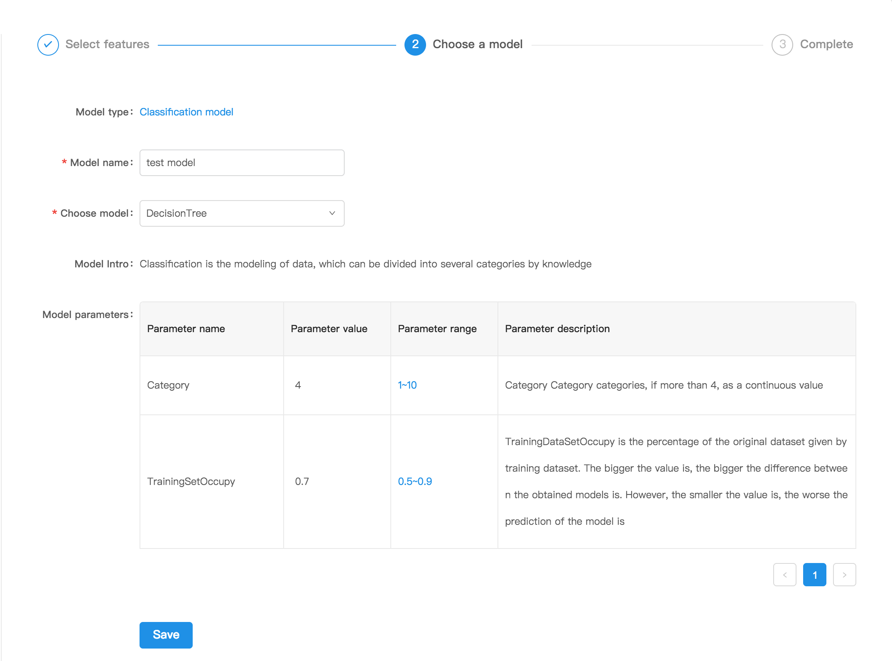
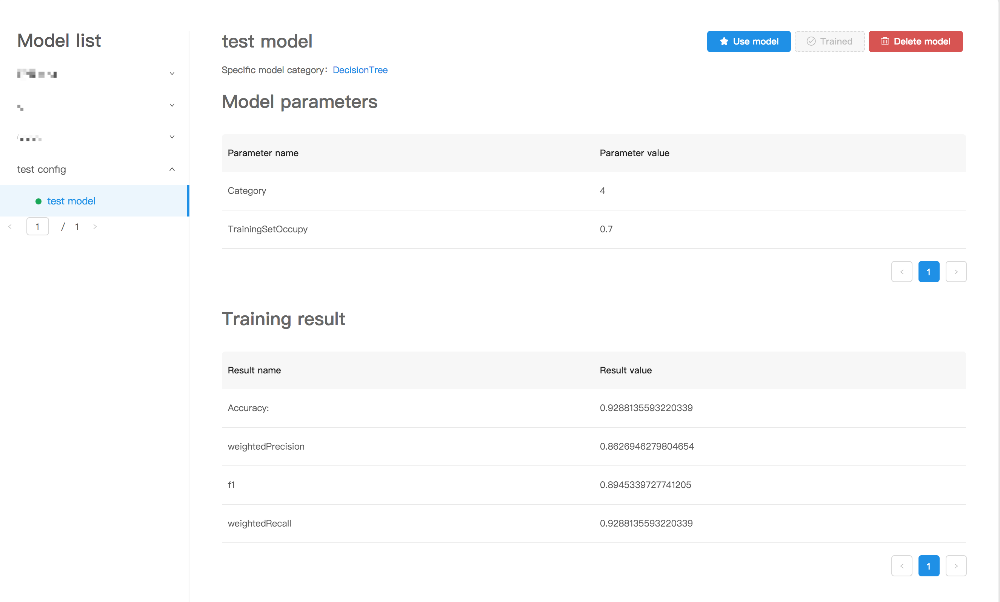
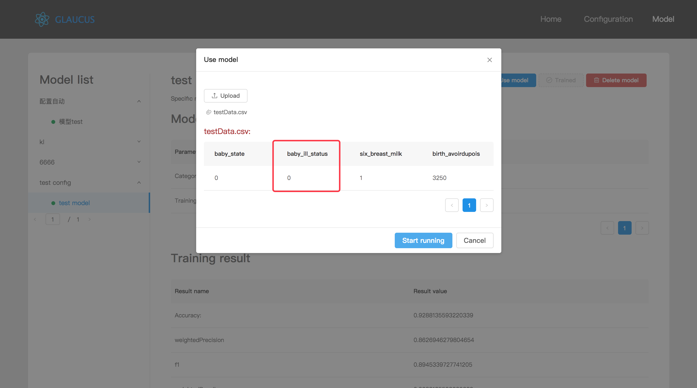

# Glaucus

- [阅读中文](https://github.com/ccnt-glaucus/glaucus/blob/master/README_CN.md) 

## What is Glaucus?
**Glaucus** is a *Data Flow* based machine learning suite that incorporates **Automated machine learning pipeline**, **Simplified the complex processes of machine learning algorithms** and applying **Excellent distributed data-processing engines**. For the **non-data science professionals** across the domain, help them get the benefits of powerful machine learning tools by a simple way. 

Our platform integrates many excellent data processing engines including **Spark**, **Tensorflow**, **Scikit-learn**, and we established a set of easy-to-use design process bases on them. The user only need to upload data, simple configuration, algorithm selection, and train the algorithm by automatic or manual parameter adjustment. The platform also provides a wealth of evaluation indicators for the training model, so that non-professionals can maximize the role of machine learning in their fields. The entire platform structure as shown below, the main functions are:

- Receive **Multi-source dataset**, including structured, document and image data;
- Provides rich **mathematical statistics function**, and the graphical interface allows users to easily grasp the data situation;
- In automatic mode, we implement **full pipe automation** from preprocessing, feature engineering to machine learning algorithms;
- In manual mode, it dramatically **simplifies machine learning pipeline processes**, and provides automated data cleaning, semi-automated feature selection, and depth learning suites.

## The Technical Architecture of Glaucus
The system adopts the MVC framework, which is roughly divided into the reaction front end, Spring Boot+Flask business layer and Spark+Scikitlearn+Keras data engine layer, as shown in the figure below. The system is divided into four parts:
  

  
- The front end uses the framework of **React+Redux**, the design part uses Ant Design, and the diagram part uses Ant Design;
- The business layer primarily uses **Spring Boot** (Java) and **Flask** (Python) as RESTful interfaces;
- The data processing framework is mainly based on the distributed framework **Spark**, which extends the storage model using HDFS and MongoDB as the data persistence layer, and extends the runtime environment based on Docker and Linux virtual machines. The optimization of Shuffle operator is carried out in our Spark framework. The distributed server part mainly shows the deployment of Spark, Hadoop and MongoDB;
- The Data Engine part primarily uses distributed machine learning libraries: **Spark ML** and **Tensorflow** based Keras framework, automated machine learning mainly uses SMAC-based **Bayesian optimizer pipe tuning** Auto-sklearn and Deap-based **Genetic Algorithm Superconducting Tuning** TPOT.

## Deploy Glaucus
Pull our project, enter `/glaucus` and there three folers: `/java`, `/python`, `/web`, deploy by the steps in [QuckStart.md](https://github.com/ccnt-glaucus/glaucus/blob/master/QuickStart.md).

## Use Glaucus
The following two examples demonstrate the use of the Glaucus platform in both manual mode and automatic mode.
### 1. Manual Mode

- First find the `/ data / test.csv` file, enter our platform, click the upload file, the data will be automatically uploaded to the cloud server, and after that, system will automatically analyze your data;

- After uploading the files, you will see the system automatically analyze the fields, then users can click **start analysis** for a brief analysis of the file, or click **add configuration** button;
- After entering the configuration interface, the first step is to fill in and select the red box to complete the configuration, including *configuration name*, *the main category of the model*, and *select training features*;

- The second step is the adjustment of specific model and parameter, as shown in the red box below;

- Finally, after confirming all the information, start training;

- After training, you can view the training model results, the system will automatically save the user training results.

- Besides that, you can use the model you trained, click **use model** on the model page, you can upload your testing data, then your trained model will predict the target feature.

### 2. Automatic Mode

- Based on `/data/test.csv`, click the **Add Configuration** button again;

- After entering the configuration interface, select **Automatic Classifier** in the `Select Model Category`, and complete the automation model after completing the red box;

- After training you can view the results of the automated training model and the selected pipeline of the training model.

## Glaucus Members
The following members contribute to **Glaucus Project**:

- [Jianwei Yin](http://mypage.zju.edu.cn/0001038), Professor, CCNT Laboratory, College of Computer Science and Technology, Zhejiang University
- [Zhiling Luo](http://www.bruceluo.net), CCNT Laboratory, College of Computer Science and Technology, Zhejiang University
- Zikun Fan, CCNT Laboratory, College of Computer Science and Technology, Zhejiang University
- Xiangyong Liao, CCNT Laboratory, College of Computer Science and Technology, Zhejiang University
- Wenbo Tang, CCNT Laboratory, College of Computer Science and Technology, Zhejiang University

